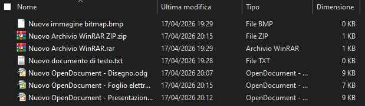
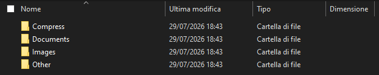
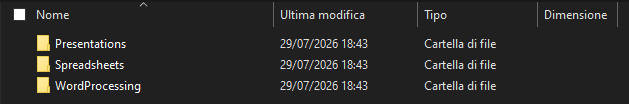
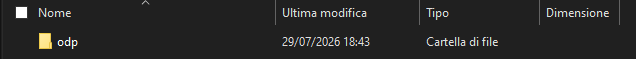
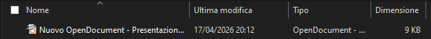

# 📁 Smart File Organizer & Sorter (Python CLI)

Un'Utility da riga di comando (CLI) sviluppata in **Python 3.10+** per organizzare, catalogare e riordinare automaticamente i file all'interno del file system.

Il progetto sfrutta la potenza di **`pathlib`** per una gestione multipiattaforma dei percorsi, implementa una mappatura estensibile per categoria/sottocategoria, un algoritmo di ordinamento custom con **Type Hinting** e un modulo di pulizia sicura delle directory rimaste vuote.

Ulteriori estensioni possono essere gestite inserendone, se necessario, il tipo di file (Es. Database), il suo uso comune (Es. Libreria) ed il suffisso dell'estensione (Es. bkshp) nel mapping predisposto su `organizer.py`:
```python
# 🐍 organizer.py 
extension = {
    ...
    "Database": {
        "Libreria": {"bkshp"}
    }
}
```

---

## ✨ Caratteristiche

* **Organizzazione Multilivello basata su Estensioni:**
    Catalogazione automatica dei file in gerarchie di cartelle tramite riconoscimento intelligente delle estensioni dei file rispetto a macro-categorie (Documenti, Musica, Immagini, Video, Archivi) e sotto-categorie specifiche.

* **Gestione Conflitti Nomi (No Overwrite):** 
    In caso di collisione si avvia un meccanismo di auto-rinominazione progressiva file  (nome_1.ext, nome_2.ext) per impedire sovrascritture o perdite accidentali dovute allo spostamento.

* **Algoritmo di Ordinamento Flessibile (Custom & Native):**
  * **Insertion Sort Personalizzato (`mySorting`):**
  Implementazione didattica ricca di *Type Hinting* (`Iterable`, `Callable`, `TypeVar`) e funzioni *Lambda* per ordinare file secondo metadati come dimensione, data di creazione/modifica o estensione.

  * **Fallback Nativo Ad Alte Prestazioni:**
  Utilizzo trasparente della funzione built-in `sorted()` di Python per la massima velocità su ampi volumi di dati.

* **Scansione Ricorsiva:**
    Opzione per includere ed elaborare anche il contenuto delle sottocartelle (--subfolders).

* **Clean-up Ricorsivo:**
    Rimozione ricorsiva delle directory rimaste vuote a seguito del riordinamento (--cleanup). 

* **Sicurezza:**
    Ignora automaticamente i collegamenti simbolici (symlink) evitando di spezzarli o di finire in cicli infiniti durante la scansione.

* **Architettura Modulare:**
    il Codice è strutturato in package con separazione netta delle responsabilità per ciascun modulo.

* **Interfaccia CLI Completa:**
    Controllo totale dell'esecuzione tramite argomenti da riga di comando gestiti via `argparse`.


| **Argomento CLI** | `tipo` | Descrizione |
|:---:|:---:|:---|
| **--cwd** | `str` | Percorso della directory da organizzare (default: cartella corrente) |
| **--subfolders**	| `flag` | Se presente, scansiona ricorsivamente anche le sottocartelle |
| **--sort** | `choice` | Modalità di ordinamento dei file (Default, Name, NameNoCase, Extension, Size) |
| **--cleanup** | `flag` | Rimuove automaticamente le cartelle rimaste vuote al termine dell'operazione |

---

## 🛠️ Tech Stack & Requisiti

* **Linguaggio:** Python 3.10+
* **Librerie di Sistema:** 
    * `pathlib` (per la gestione object-oriented dei percorsi).
    * `shutil` (per le operazioni di I/O ad alte prestazioni).
* **Dipendenze:** Nessuna libreria esterna (100% Python Standard Library).

---

## 📐 Struttura Mapping Estensioni

L'organizzatore suddivide i file tramite una struttura dati a dizionario nidificato (`extensions`):
```text
Risultato (massima profondità)

📂Target Directory/
├──📂 Documents/
│   ├──📂 WordProcessing/
│   │   ├──📄 .docx
│   │   ├──📄 .doc
│   │   ├──📄 .odt
│   │   ├──📄 .rtf
│   │   └──📄 .txt
│   │
│   ├──📂 Spreadsheets/
│   │   ├──📈 .xlsx
│   │   ├──📈 .xls
│   │   ├──📈 .csv
│   │   └──📈 .ods
│   │
│   ├──📂 Presentations/
│   │   ├──📊 .pptx
│   │   ├──📊 .ppt
│   │   └──📊 .odp
│   │
│   ├──📂 PortableShared/
│   │   └──💾 .pdf
│   │
│   └──📂 WebOther/
│       ├──🌐 .html
│       ├──🌐 .xml
│       └──🌐 .epub
│
├──📂 Images/
│   ├──📂 Standard/
│   │   ├──🖼 .jpg
│   │   ├──🖼 .jpeg
│   │   ├──🖼 .png
│   │   ├──🖼 .gif
│   │   └──🖼 .webp
│   │
│   ├──📂 Professional/
│   │   ├──📷 .tiff
│   │   ├──📷 .tif
│   │   ├──📷 .bmp
│   │   ├──📷 .heic
│   │   └──📷 .heif
│   │
│   ├──📂 Vectorial/
│   │   ├──🖋 .svg
│   │   ├──🖋 .eps
│   │   └──🖋 .ai
│   │
│   └──📂 Modification/
│       ├──🎨 .psd
│       ├──🎨 .xcf
│       └──🎨 .raw
│
├──📂 Video/
│   ├──📂 VideoUniversal/
│   │   ├──🎞 .mp4
│   │   ├──🎞 .webm
│   │   └──🎞 .m4v
│   │
│   ├──📂 VideoLegacy/
│   │   ├──🎬 .mov
│   │   ├──🎬 .avi
│   │   └──🎬 .wmv
│   │
│   ├──📂 VideoProfessional/
│   │   ├──📽 .mkv
│   │   ├──📽 .mts
│   │   ├──📽 .m2ts
│   │   └──📽 .vob
│   │
│   └──📂 VideoMobile/
│       ├──📹 .3gp
│       └──📹 .flv
│
├──📂 Music/
│   ├──📂 CompressedStandard/
│   │   ├──🎵 .mp3
│   │   ├──🎵 .aac
│   │   ├──🎵 .ogg
│   │   ├──🎵 .wma
│   │   └──🎵 .m4a
│   │
│   ├──📂 CompressedLossless/
│   │   ├──🎼 .flac
│   │   ├──🎼 .alac
│   │   └──🎼 .ape
│   │
│   ├──📂 NoCompressed/
│   │   ├──🎶 .wav
│   │   ├──🎶 .aiff
│   │   └──🎶 .pcm
│   │
│   └──📂 DataAndInstructions/
│       ├──🎤 .mid
│       ├──🎤 .midi
│       ├──🎤 .opus
│       └──🎤 .dsd
│
└──📂 Compress/
    ├──📂 Standard/
    │   ├──📚 .zip
    │   └──📚 .rar
    │
    ├──📂 Hight Compression/
    │   ├──📕 .7z
    │   └──📕 .tgz"
    │
    └──📂 OS specific/
        ├──📒 dmg
        ├──📒 iso
        └──📒 cab

```

---

## 🗂️ Struttura del Progetto

```text
file-organizer/
├──📑 main.py                # Entry point dell'applicazione (CLI / Execution)
└── organizer/             # Package principale dei moduli
    ├──📦 __init__.py        # Inizializzazione del package Python
    ├──📋 sorter.py          # Algoritmi di ordinamento (custom e built-in)
    ├──📋 filesystem.py      # Scansione del filesystem e ricerca file
    ├──📋 organizer.py       # Logica core di smistamento ed estensioni
    └──📋 cleanup.py         # Utility per la rimozione delle cartelle vuote
```

## 🚀 Come Compilare ed Eseguire

```bash
python [YourPath]/main.py --cwd [FolderPath] --subfolders --sort "Default" --cleanup
```

---
## ✂️ Screenshot

### Contenuto Target folder
(prima)

(dopo)

(/Documents)

(/Presentations)

(/odp)


---
